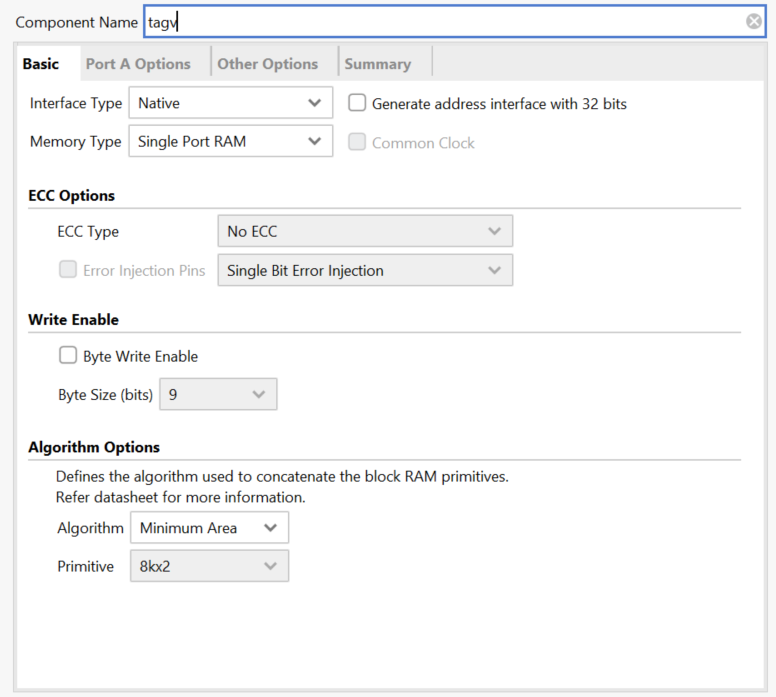
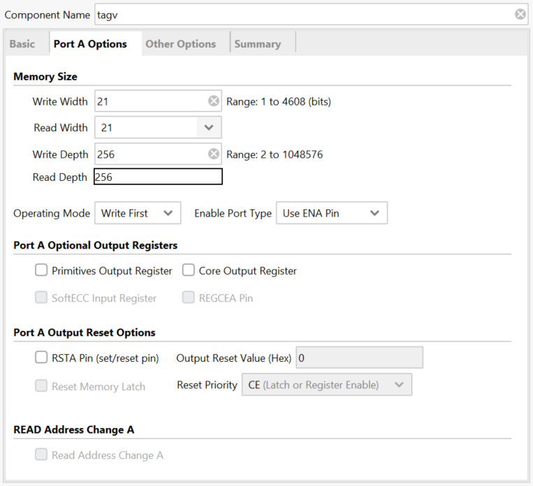
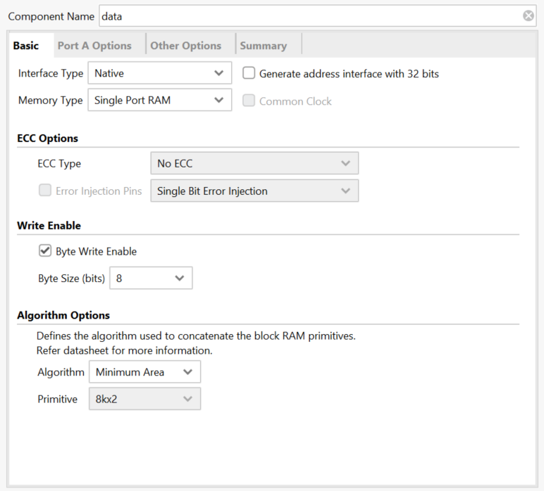
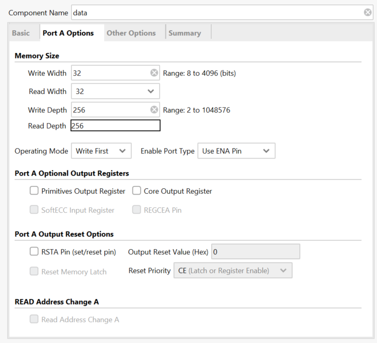

# ucas-ca-lab
## bench of div and mul has been released in branch exp10_pipeline 
- to test the div module or mul module, use test_<module_name>.v as simulation and <module_name>.v as design
- div_0_gen is signed and div_1_gen is unsigned
- mul_test do signed mul, replace
```v
assign tempans = $signed(extended_x) * $signed(extended_y) ;
```
with your module.

## How to add cache RAMs

search IP catalog: `Block Memory Generator`

- tagv:

  

  

- data:

  

  


